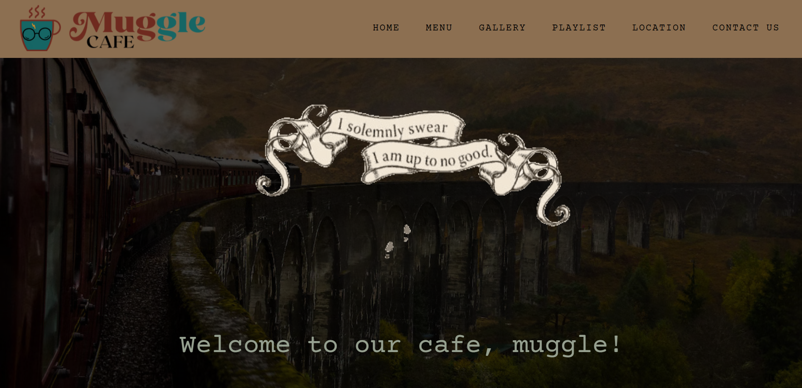

<h2 align='center'>MUGGLE CAFE</h2>

<b>Website about Harry Potter themed cafe called Muggle Cafe</b>

<h2>✨ Navigations</h2>

__Homepage__
This project is a whole website in a single HTML file so the content of the homepage comprises all the content of the navigations. 

__Menu__
This section consist of the menus offered in the cafe. From the coffees, teas, and desserts.

__Gallery__
Bask in the interior of the Muggle Cafe. This is a Harry Potter fan dreams come to life.

__Playlist__
What is a cafe without its cozy playlist? Hear the different background music that are included in the Harry Potter movies itself.

__Location__
This is just a project for our Game Development subject but the cafe inspiration for this website is real! In the map located in the Location tab, pinned is where you can find the real Muggle Cafe.

__Contact Us__
This sections also serves as the footer section. Linked are the different social accounts and about the developer.

<h2>🖥️ This project is deployed via Netlify</h2>

__Please visit --->__ [Muggle Cafe](https://mugglecafe.netlify.app/)

<h2>📫 How to reach me:</h2>
Hit me up with some suggestions on how can I further improve this website

  

<b>Thank you for visiting! May the force be with you ⚔️⭐</b>
